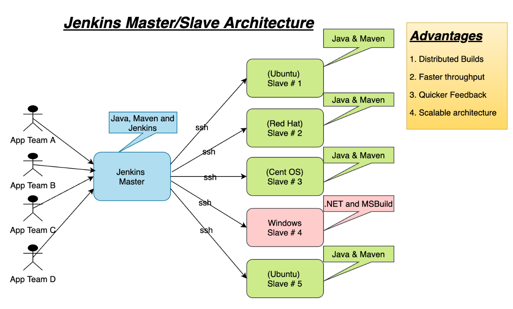

#  Jenkins Architecture

Jenkins follows a **controller-agent** (formerly **master-slave**) architecture, which separates the tasks of **managing jobs** and **executing builds**.

This makes Jenkins:
-  Scalable  
-  Fault-tolerant  
-  Easy to distribute across environments  

---

##  Key Components

### 1. Jenkins Controller

The **main Jenkins server** responsible for managing all CI/CD operations.

It handles:

- Job configuration  
- Scheduling of builds  
- Web UI and dashboard  
- Plugin management  
- Build queue and assignment  

>  The controller **can run builds**, but this is **not recommended** for large or production systems.

---

### 2.  Jenkins Agents (Nodes)

**Agents** are external machines or containers that **run the actual jobs** (builds, tests, deployments).

They can be:

- Physical servers  
- Virtual machines (VMs)  
- Docker containers  
- Kubernetes pods  

Agents are selected based on:

- Job labels  
- Operating system  
- Load balancing or resource availability

---

### 3.  Executor

An **Executor** is a slot on an agent that can handle **one job at a time**.

- Each agent may have **multiple executors**
- Enables **parallel execution** of jobs on the same agent

---

## Jenkins Architecture

##  How It Works

1. Developer pushes code to Git (e.g., GitHub).  
2. Jenkins Controller is notified (via webhook or polling).  
3. It schedules a job and assigns it to an appropriate **Agent**.  
4. Agent runs the **build**, **test**, and **deployment** steps.  
5. Results are reported back to the Controller.  
6. Build status is shown in the Jenkins dashboard.  

---

##  Benefits of This Architecture

| Feature      | Benefit                                |
|--------------|-----------------------------------------|
| Scalability  | Add more agents for parallel builds     |
| Flexibility  | Use different OS environments per agent |
| Isolation    | Keep builds separate and clean          |
| Efficiency   | Offload heavy workloads from controller |

---
