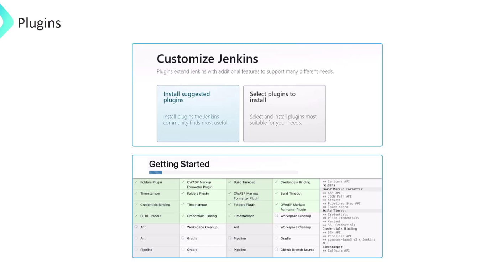

# Jenkins Plugins

## What Are Jenkins Plugins?

Jenkins plugins are modular components that extend the core functionality of Jenkins. They allow Jenkins to integrate with tools, add new features, or customize behavior — making Jenkins highly flexible and adaptable for different DevOps and CI/CD needs.

---

##  Why Plugins Matter

Jenkins is designed to be minimal by default.

Plugins are how you add support for:

- **Source control** (like Git, GitHub, Bitbucket)  
- **Build tools** (like Maven, Gradle, Ant)  
- **Deployment** (Docker, Kubernetes, AWS)  
- **Notifications** (Slack, email)  
- **Test reporting**, code analysis, UI themes, and much more  

---

##  Common Types of Jenkins Plugins

| **Plugin Type**         | **Examples**                              | **Purpose**                                     |
|-------------------------|--------------------------------------------|-------------------------------------------------|
| SCM Plugins             | Git, GitHub, Bitbucket                    | Connect to version control                      |
| Build Tool Plugins      | Maven, Gradle, Ant                        | Compile and build code                          |
| Pipeline Plugins        | Pipeline, Workflow, Blue Ocean           | Create complex CI/CD pipelines                  |
| Notification Plugins    | Email Extension, Slack Notification      | Alert users about job status                    |
| UI/UX Plugins           | Blue Ocean, Dashboard View               | Improve or customize Jenkins interface          |
| Testing Plugins         | JUnit, TestNG, Cucumber Reports          | Display test results                            |
| Security Plugins        | Role-based Authorization, LDAP           | Manage authentication and authorization         |
| Deployment Plugins      | Docker, Kubernetes, AWS CodeDeploy       | Automate deployments                            |
| Utility Plugins         | Credentials, Environment Injector        | Add helper functions and configurations         |

---

##  Where to Find Plugins

- Jenkins Plugin Index: [https://plugins.jenkins.io/](https://plugins.jenkins.io/)
- Or directly in Jenkins under:  
  `Manage Jenkins → Manage Plugins`

---

##  Things to Keep in Mind

- Too many plugins can slow Jenkins down and increase the risk of conflicts.
- Always check **compatibility** with your Jenkins version before installing.
- Regularly **update plugins** to get bug fixes and security patches.
- Some plugins are no longer maintained — avoid outdated or deprecated ones.
