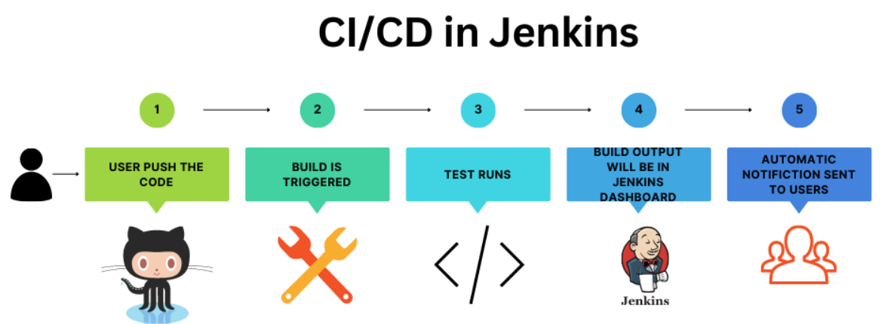

# Jenkins

## What is Jenkins
Jenkins is an open-source automation tool written in Java with plugins built for Continuous Integration and Continuous deployment/delivery purposes.

## Why Jenkins
Jenkins is used to build and test your software projects continuously make it easier for developers to integrate changes to the project, and make it easier for users to obtain a fresh build. It provides many plugins that help to support building, deploying and automating any project.

## Jenkins Workflow




## Continuous Integration

Continuous Integration (CI) is a software development practice where code is continuously tested after a commit to ensure there are no bugs. The common practice is that whenever a code commit occurs, a build should be triggered.

## Continuous Deployment

Continuous Deployment (CD) is a software development process where code changes to an application are released automatically into the production environment.

## Continuous Delivery

Continuous Delivery is a software development practice where code changes are built, tested, and then pushed to a non-production testing or staging environment. Final deployment to production is made after manual approval.

---

##  Advantages of Jenkins

- Open-source tool
- Easy to install
- Platform-independent
- Supports 1000+ plugins
- Free of cost
- Automates integration

---

##  Jenkins Installation Steps

1. **Install Java Development Kit (JDK)**
2. **Set the PATH environment variable for JDK**
3. **Download and install Jenkins**
4. **Check if Jenkins service is running:**

##  Webhook Integration

A **webhook** in Jenkins triggers a pipeline automatically whenever changes are made in a GitHub repository, such as a commit or push.

### Steps to Configure:

1. **Copy Jenkins URL**
2. Go to your **GitHub repository → Settings**
3. Click on **Webhooks → Add Webhook**
4. Paste the Jenkins URL
5. **Append** the URL with: `/github-webhook/`
   - Example: `http://your-jenkins-url/github-webhook/`
6. Set the **Content type** to `application/json`
7. Choose trigger events (e.g., `Just the push event`)
8. Click **Add webhook**

---

##  Continuous Deployment

Automatically deploy code to a **production server** after a successful Jenkins pipeline build.

### Steps:

1. Go to **Jenkins → Manage Jenkins**
2. Install the **Remote SSH** plugin
3. Connect the **remote production server** via SSH
4. Configure a **Global Property** in Jenkins to store the production server's IP
5. Add **credentials** and the **hostname** of the production server
6. **Test the SSH connection** to ensure Jenkins can access the production server

```groovy
withCredentials([usernamePassword(credentialsId: 'prodserver_login', usernameVariable: 'USERNAME', passwordVariable: 'PASSWORD')])

```
### to connect to production server


## Continuous Deployment using Docker

### Push docker image to docker hub
 
``` groovy 

  withRegistry('https://registry.hub.docker.com', 'docker_hub_login')
```


### Ask approval before deploying to production

``` groovy
  input 'Deploy to Production?'

```

### Use milestone to accidently deploying old version over a new version

``` groovy

  milestone(1)
``` 

# Create build agent on a second server

- Login slave from master using ssh
- Create user's home directory at worker node
- sudo mkdir /var/lib/jenkins
- sudo useradd -d /var/lib/jenkins jenkins
- sudo chown -R jenkins:jenkins /var/lib/jenkins
- sudo mkdir /var/lib/jenkins/.ssh
- Copy the contents of ~/.ssh/id_rsa.pub to the file /var/lib/jenkins/.ssh/authorized_keys
- cat ~/.ssh/id_rsa.pub # Copy the output
- sudo vim /var/lib/jenkins/.ssh/authorized_keys
- Paste id_rsa contents into jenkins
- Create an .ssh directory on the master in the jenkins directory: sudo mkdir /var/lib/jenkins/.ssh
- Copy the known_hosts entry over from the .ssh directory in master jenkins user's .ssh directory: sudo cp ~/.ssh/known_hosts /var/lib/jenkins/.ssh
- Create new node on jenkins master
- Remote dir:/var/lib/jenkins Labels:Linux Host:Ip of worker node
- Add creds worker node and paste private key

# Monitoring in Jenkins

- Install any monitoring plugins like Prometheus, grafana, datadog and so on.
- SSH into prometheus server
- Edit vi /etc/prometheus/prometheus.yml file
- Add jenkins target - ip:8080
- Restart prometheus
- Hit endpoints and see data scrape by prometheus

# Backup in Jenkins

- Install Thin Backup plugin
- Create directory jenkinsbackup and cd into it.
- Set write permission to directory
- Go to jenkins enter dir path and backup and restore jenkins
   
-------------------------------------------------------------------------------------------------------------------------------
