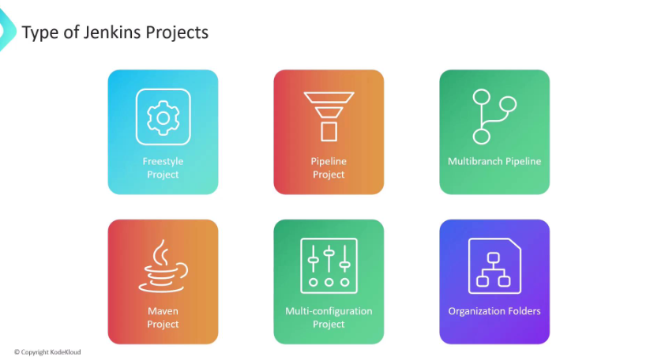
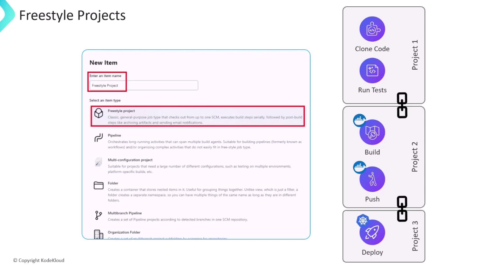
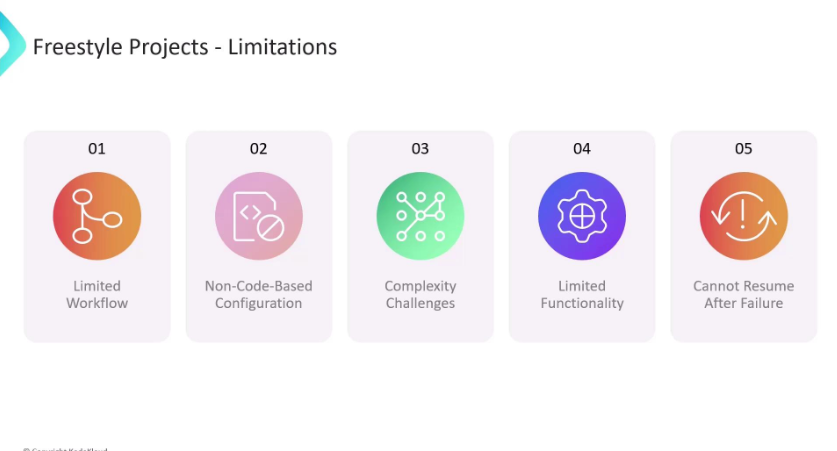

# Jenkins Projects

## What is a Jenkins Project?

A Jenkins project (also called a job) is a runnable task configured in Jenkins. It defines what Jenkins should do — like building code, running tests, deploying software, or anything automated.

Each project has its own configuration for how to perform the build, what triggers it, what source code to use, what steps to run, and where to report results.

---

# Types of Jenkins Projects

## Freestyle Project

- The most basic and flexible project type.
- Allows you to configure build steps, source code management, triggers, and post-build actions.
- Supports different types of builds like shell scripts, batch commands, or invoking other build tools.
- Good for simple or moderately complex pipelines.

## Key Limitations of Jenkins Freestyle Projects

### Limited Flexibility and Scalability
Freestyle projects are relatively simple and don’t scale well for complex workflows. They lack the advanced pipeline features that Jenkins Pipeline jobs offer.

### No Native Support for Complex Pipelines
You can’t easily model complex build flows, parallel executions, or conditional steps like you can with Jenkins Pipeline (Declarative or Scripted).

### Manual Configuration Heavy
Freestyle projects require a lot of manual UI-based configuration, which can be error-prone and hard to version control.

### Poor as Code
Freestyle jobs don’t support “Pipeline as code” — you can’t store the job configuration in a Jenkinsfile or source control easily.

### Limited Parameterization
While parameters are supported, the flexibility is less compared to pipeline scripts that can dynamically generate parameters and stages.

### Plugin Dependency
Many advanced features require additional plugins, increasing maintenance overhead and risk of incompatibilities.

### Difficult to Maintain for Large Projects
With many freestyle jobs, managing and updating them becomes cumbersome, unlike pipelines that can be managed centrally with code.

## Pipeline Project

- Allows you to define the entire build process as code using the Jenkins Pipeline DSL (written in Groovy).
- Supports complex workflows including parallel execution, conditional steps, and multiple stages.
- Pipeline scripts can be stored in source control, making builds reproducible and versioned.
- Can be created as:
  - **Declarative Pipeline** (simpler syntax, recommended for most use cases)
  - **Scripted Pipeline** (more flexible, fully programmable)

## Multibranch Pipeline Project

- Automatically creates Jenkins pipelines for each branch in your source control repository.
- Great for projects that have multiple branches, like feature branches or release branches.
- Jenkins discovers branches, runs their pipeline scripts, and organizes results automatically.

## Folder Project

- Not a build job, but a way to organize other jobs and projects into folders.
- Helps manage large numbers of jobs with hierarchy and permissions.

## Other Specialized Project Types

- **Maven Project:** For Maven-based builds, with lifecycle integration and reporting.
- **External Job:** For jobs run outside Jenkins but monitored inside it.
- Some plugins provide their own project types for specific needs (e.g., GitHub Organization, Multiconfiguration).

---

## Summary Table

| Project Type           | Description                               | Use Case                        |
|------------------------|-------------------------------------------|--------------------------------|
| Freestyle Project      | Basic, flexible job with UI configuration | Simple builds and scripts       |
| Pipeline Project       | Code-defined build process (Groovy)       | Complex, scripted pipelines     |
| Multibranch Pipeline   | Auto-manage pipelines for multiple branches| Projects with many branches     |
| Folder Project         | Organize jobs into folders                  | Managing large job collections  |
| Maven Project          | Specialized Maven lifecycle support         | Java projects using Maven       |
